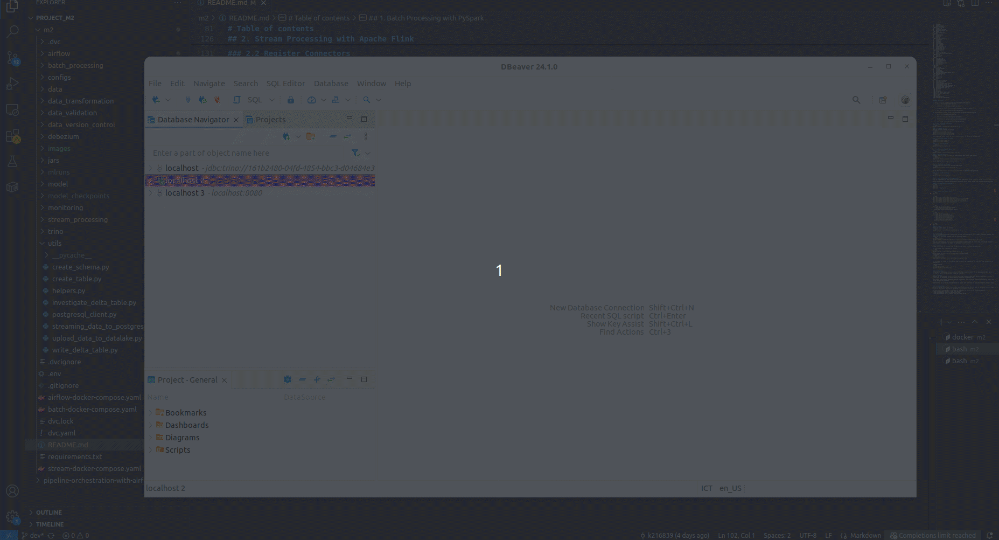
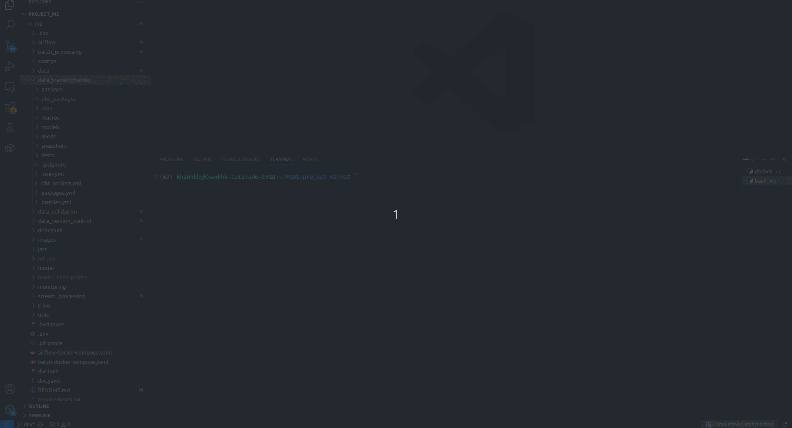
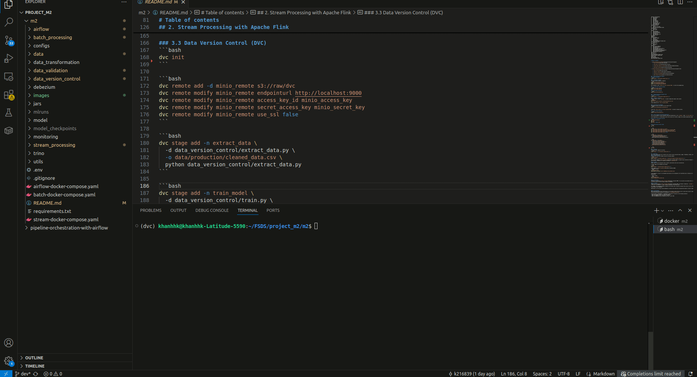
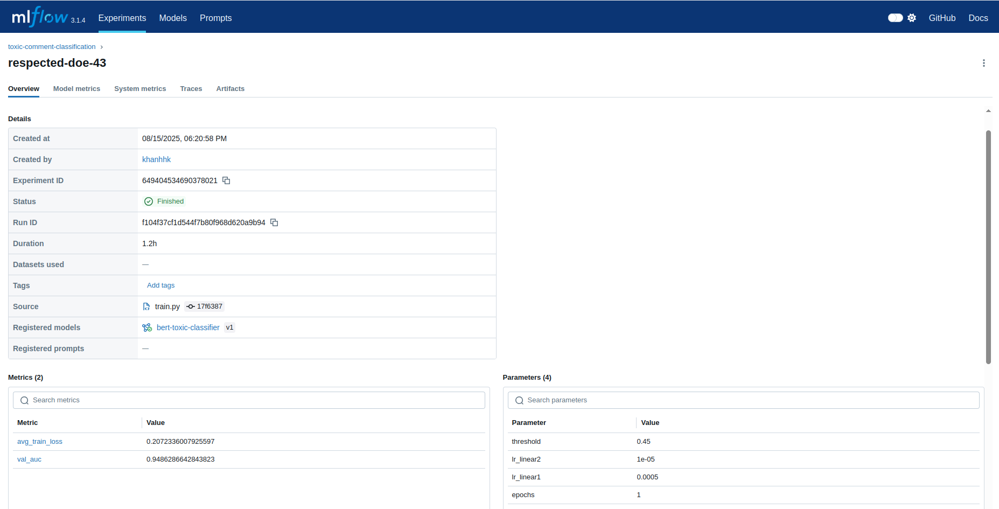
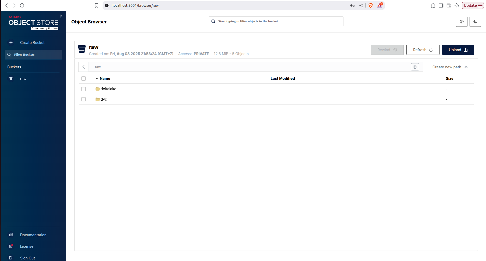
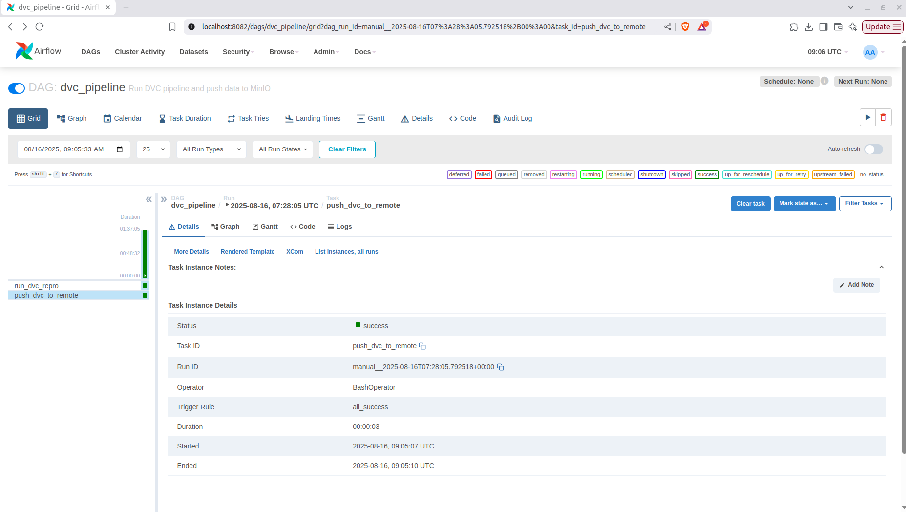
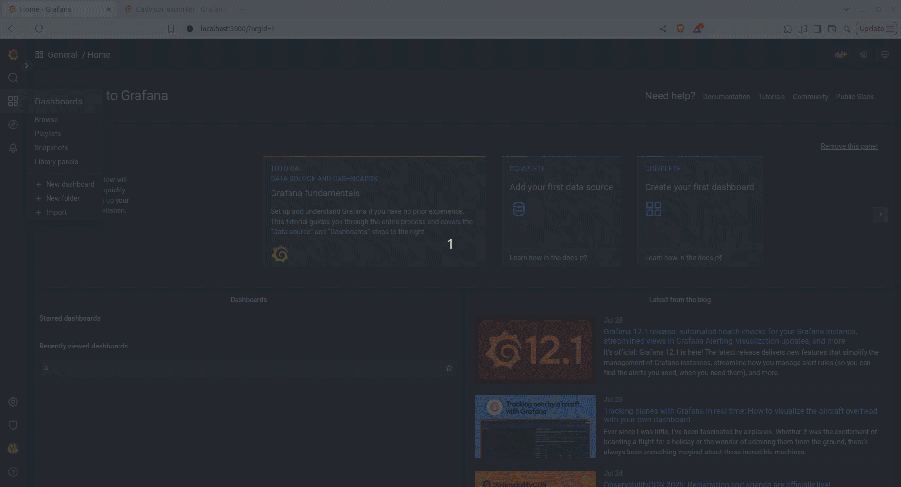
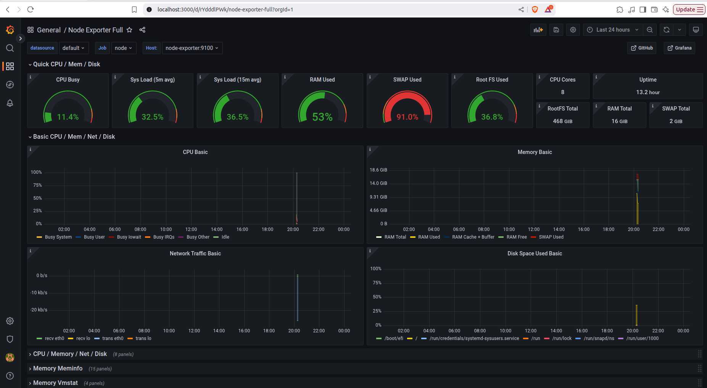

# Data Systems for Toxic Comment Classification

# Description
**Data Systems for Toxic Comment Classification** is a comprehensive end-to-end data and MLOps pipeline designed to support toxic comment classification using machine learning. The system integrates batch and streaming data workflows with Delta Lake and PostgreSQL, enabling both historical and real-time processing. Raw CSV files are ingested into a MinIO-backed lakehouse and processed via Apache Spark, while streaming updates are captured using Debezium, passed through Kafka, and handled by Apache Flink. Data is validated with Great Expectations, transformed using dbt, and managed in a staging-production schema within the data warehouse. Trino, connected to Hive Metastore, provides unified querying across lakehouse and warehouse layers. Model training and retraining are orchestrated by Apache Airflow, with data versioned by DVC and models tracked via MLflow. A full monitoring stack, including Prometheus, Grafana, Elasticsearch, and Kibana, ensures observability across the entire workflow. This architecture provides a robust, modular foundation for deploying and maintaining high-quality toxic comment classifiers in a local environment.

# System Architecture


# Project Structure
```txt
├── .dvc
│    ├── .gitignore
│    └──  config
├── airflow                               
│    ├── dags
│    ├── Dockerfile
│    └── requirements.txt
├── batch_processing                               
│    ├── main.py
│    ├── minio_config.py
│    ├── requirements.txt
│    └── spark_session.py    
├── configs                              
│    └──  config.yaml              
├── data                               
│    ├── deltalake                                
│    └── raw
├── data_transformation                             
│    ├── models
│    ├── tests
│    ├── .gitignore
│    ├── .user.yml
│    ├── dbt_project.yml
│    ├── packages.yml                        
│    └── profiles.yml
├── data_validation                            
│    ├── gx
│    ├── full_flow.ipynb                                 
│    └── reload_and_validate.ipynb
├── debezium
│    ├── configs        
│    └── run.sh                  
├── gifs
├── images
├── jars
├── model_experiment                          
│    ├── config.py                                      
│    ├── dataloader.py
│    ├── extract_data.py                          
│    ├── model.py
│    ├── requirements.txt           
│    └── train.py
├── monitoring                             
│    ├── alertmanager        
│    ├── elk
│    ├── grafana            
│    ├── prometheus              
│    └── prom-graf-docker-compose.yaml         
├── stream_processing
│    ├── main.py                                        
│    └── requirements.txt            
├── trino
│    ├── catalog
│    └── etc
├── utils                                           
│    ├── create_schema.py         
│    ├── create_table.py                         
│    ├── load_config_from_file.py
│    ├── investigate_delta_table.py
│    ├── postgresql_client.py
│    ├── streaming_data_to_postgresql.py
│    ├── upload_data_to_datalake.py
│    └── write_delta_table.py
├── .dvcignore
├── .env
├── .gitignore
├── airflow-docker-compose.yaml
├── datalake-docker-compose.yaml
├── dvc.lock
├── dvc.yaml
├── kafka-debezium-docker-compose.yaml
└── requirements.txt 
```

# Table of contents

1. [Batch Processing with PySpark](#1-batch-processing-with-pyspark)
    1. [Start Services](#11-start-services)

    2. [Push Data to MinIO](#12-push-data-to-minio)

    3. [Create Data Schema and Tables](#13-create-data-schema-and-tables)

    4. [Run Batch Processing](#14-run-batch-processing)

2. [Stream Processing with Apache Flink](#2-stream-processing-with-apache-flink)

    1. [Start Services](#21-start-services)

    2. [Register Connectors](#22-register-connectors)

    3. [Initialize the Database](#23-initialize-the-database)

    4. [Run Stream Processing](#24-run-stream-processing)

3. [Data Quality and Transformation](#3-data-quality-and-transformation)

    1. [Data Validation with Great Expectations](#31-data-validation-with-great-expectations)

    2. [Data Transformation with dbt](#32-data-transformation-with-dbt)

4. [Machine Learning Workflow with DVC](#4-machine-learning-workflow-with-dvc)

    1. [Initialize DVC and Remote](#41-initialize-dvc-and-remote)

    2. [Define and Run Pipeline Stages](#42-define-and-run-pipeline-stages)

5. [Workflow Orchestration with Airflow](#5-workflow-orchestration-with-airflow)

6. [Monitoring Stack](#6-monitoring-stack)

    1. [ELK Stack](#61-elk-stack)

    2. [Prometheus](#62-prometheus)

    3. [Grafana](#63-grafana)

    4. [Alertmanager](#64-alertmanager)

## 1. Batch Processing with PySpark
### 1.1 Start Services
```shell
docker compose -f datalake-docker-compose.yaml up -d
```
### 1.2 Push Data to MinIO
Execute the following scripts in order:
```shell
python utils/write_delta_table.py
python utils/upload_data_to_datalake.py
python utils/investigate_delta_table.py
```
Access `MinIO` at `http://localhost:9001/` to verify the uploaded data.

### 1.3 Create Data Schema and Tables
```shell
python utils/create_schema.py
python utils/create_table.py
```
### 1.4 Run Batch Processing
```shell
python batch_processing/main.py
```


## 2. Stream Processing with Apache Flink
### 2.1 Start Services
```shell
docker compose -f kafka-debezium-docker-compose.yaml up -d
```
### 2.2 Register Connectors
Connect `Debezium` with `PostgreSQL` to capture Change Data Capture (CDC) events:
```shell
cd debezium/
bash run.sh register_connector configs/postgresql-cdc.json
```
Access Debezium UI at `http://localhost:8085/`.

### 2.3 Initialize the Database
Periodically insert new records into the target table:
```shell
python utils/streaming_data_to_postgresql.py
```

Access the `Control Center` at `http://localhost:9021/` to monitor incoming records.

### 2.4 Run Stream Processing
```shell
python stream_processing/main.py
```



## 3. Data Quality and Transformation
### 3.1 Data Validation with Great Expectations
Refer to the following notebooks for full examples:
- `data_validation/full_flow.ipynb`
- `data_validation/reload_and_validate.ipynb`

Great Expectations allows definition and enforcement of data quality expectations in your data pipeline.


### 3.2 Data Transformation with dbt
```bash
cd data_transformation/
dbt clean
dbt deps
dbt build --target prod
```



## 4. Machine Learning Workflow with DVC
### 4.1 Initialize DVC and Remote
```bash
dvc init
```

```bash
dvc remote add -d minio_remote s3://raw/dvc
dvc remote modify minio_remote endpointurl http://localhost:9000
dvc remote modify minio_remote access_key_id minio_access_key
dvc remote modify minio_remote secret_access_key minio_secret_key
dvc remote modify minio_remote use_ssl false
```

### 4.2 Define and Run Pipeline Stages
```bash
dvc stage add -n extract_data \
  -d model_experiment/extract_data.py \
  -o data/production/cleaned_data.csv \
  python model_experiment/extract_data.py
```

```bash
dvc stage add -n train_model \
  -d model_experiment/train.py \
  -d model_experiment/dataloader.py \
  -d model_experiment/model.py \
  -d model_experiment/config.py \
  -d data/production/cleaned_data.csv \
  python model_experiment/train.py
```

```bash
dvc repro
```







## 5. Workflow Orchestration with Airflow
Start Airflow:
```shell
docker compose -f airflow-docker-compose.yaml up -d
```
Important: Update DVC remote for container compatibility:
```shell
dvc remote modify minio_remote endpointurl http://minio:9000
```



## 6. Monitoring Stack
This section demonstrates how to monitor your services locally using ELK Stack, Prometheus, Grafana, and Alertmanager.
### 6.1 Elastic Search
Start the ELK stack with Filebeat using the following command:
```bash
cd monitoring/elk/
docker compose -f elk-docker-compose.yml -f extensions/filebeat/filebeat-compose.yml up -d
```
You can access Kibana at [http://localhost:5601](http://localhost:5601) to explore logs collected by Filebeat from container output and shipped to Elasticsearch. Credentials for Kibana are defined in `monitoring/elk/.env`.


### 6.2 Prometheus
To start Prometheus and Grafana:
```bash
cd monitoring/
docker compose -f prom-graf-docker-compose.yaml up -d
```
Prometheus is available at [http://localhost:9090](http://localhost:9090).

### 6.3 Grafana
Grafana can be accessed at [http://localhost:3001](http://localhost:3001) with default credentials: `username: admin, password: admin`. You can either create your own dashboards or import community dashboards from Grafana Labs.

For example, the following dashboard (imported from Grafana Labs) visualizes container-level metrics such as CPU usage, memory usage, and memory cache using cAdvisor and Prometheus.



Additionally, you can build custom dashboards to monitor both node-level and application-specific resource usage.



### 6.4 Alertmanager
While monitoring services and infrastructure, you can define custom alerting rules to notify when resource usage exceeds predefined thresholds. These rules and notification settings are configured in `alertmanager/config.yml`.

In this project, Alertmanager is configured to send alerts to Discord in the following scenarios:
+ When the available memory on a node drops below 5%.
+ When the CPU usage on a node exceeds 50%.
+ When the available disk space on a node drops below 10%.

